This is a short beginner’s guide on how to work with open source
within GitHub flow practices. All examples will use the GitHub
platform, but other repository hosting services that provide the
necessary functionality to implement GitHub flow can also be
used. Here you can find a classic way to contribute to almost any
project, as well as learn a few tips and hacks.

So, where does any contribution begin? Ideally, with a problem.
A problem can be called anything, including a lack of new
features, missing or incomplete documentation pages on a specific
topic, some question, or simply trivial bugs that exist
everywhere. You personally will not confuse a problem with
anything else, because it will be accompanied by an itchy feeling
that “something is annoying.” But will this be a problem for
other users and developers? In order to understand this and
synchronize your perception with the team’s perception, an issue
exists.

> [!CAUTION] CONTRIBUTION.md
> Every project has its own established rules on how to
> participate in it. These rules are described either in
> `README.md` in a separate “Contribution” paragraph, or in
> a special `CONTRIBUTION.md` file. Be sure to read it at the
> very beginning. This file has the highest priority. That is,
> even if you understand that some practices deviate from the
> correct scheme that we will consider below, you should still
> follow them. Some large projects, such as `Postgres` or
> `linux-kernel`, still work entirely via mailing lists. One
> should respect the traditions that have formed in the
> repository, even if they now look like legacy.

## 1. Issue

An issue is a ticket that is stored in the repository. Anyone who
comes to the repository can create it. But I recommend that
before rushing to describe your problem, you make several
attempts to search for similar issues, so as not to burden the
repository maintainers with unnecessary work. Let’s see how this
can be done:

```sh
gh issue list --search "app crashed"
```

> This and all further examples will use the official `gh`
> utility. It allows you to perform all basic GitHub operations
> from the console. I recommend using it for simple operations to
> speed up your workflow.

The `search` parameter allows you to add various search filters
directly inside it. Let’s try to add them:

```sh
gh issue list --search "app crashed is:open label:bug created:>2024-01-01"
```

It is quite possible, especially in large projects, that this
will allow you to find an already created ticket for your problem
and even find a solution or answer in it. If not, then do not
hesitate to open a new issue. The following scheme will help
structure it in the best way:


In large projects, there are issue templates that will help you
format an issue according to the standards adopted in that
project. You can create an issue with the command:

```sh
gh issue create
```

Another excellent practice is providing a Docker image in which
the entire environment is configured and the problem is
guaranteed to be reproducible. Or at least provide a log.
A professional approach would also be to localize the problem as
much as possible. For example, you received an error in the
following file:

```python
import fruits
import logistic

a = fruits.Apple()
basket = fruits.MakeBasket()
basket.put(a)
logistic.send(basket)
```

Of course, you could write exactly this in the issue. But it
would be even better to independently experiment with this code
and understand what exactly is wrong. For example, check whether
the apple was successfully added to the basket:

```python
basket.put(a)
print(basket.content())
```

Perhaps the problem is that we are trying to send an empty
basket, which would mean a bug in the `put` method. Or perhaps
the problem is in the `send` method after all. In this way, we
cut off the unnecessary, leaving the essence of the problem in
the issue message.

Remember that even the fact of successfully creating an issue—for
example, proposing a valuable feature or discovering a real bug
or vulnerability—is already a contribution to the project, and
that is already a success. A failure, on the other hand, would be
creating a duplicate issue or overloading maintainers with
unnecessary context.

## 2. Fork

When you understand which problem you are solving and are
convinced that it is really a problem, you can move on to solving
it. To do this, you should first fork the repository. This will
be valuable support for you if, for example, you are testing CI
or simply getting far ahead of the original repository, and it
will also allow you to send pull requests, since you most likely
do not have permission to make changes to the original
repository:

```sh
gh repo fork <OWNER>/<REPO>
```

After cloning the fork locally, make changes in a separate
branch, which it will be more convenient to name after the issue
number you are trying to close. Why? Because in a short, concise
branch name it is **far** from always possible to express the
essence of the problem, which may have taken several months of
discussion in the ticket. Therefore, it is much more convenient
to simply refer to it by the issue number:

```sh
git switch -c 42
```

In GitHub flow, we do not create a complex branch structure where
each branch has its own meaning. Instead, we have a master branch
into which only changes that have passed all checks are merged.
These changes come there from many so-called feature branches,
which we propose to tie to specific issues. And from time to
time, we release a version from the master branch. As a result,
we get a fairly concise structure:

```mermaid
%%{init: {
  "gitGraph": {
    "tagLabelColor": "#ffffff",
    "tagLabelBackground": "#d73a49"
  }
}}%%
gitGraph
    commit
    commit
    branch "42"
    checkout "42"
    commit
    commit
    checkout main
    merge "42"
    commit tag: "🚩 v1.1.23"

    branch "44"
    checkout "44"
    commit
    commit
    commit
    checkout main
    merge "44"
    commit tag: "🚩 v1.2.0"
```



Also, do not forget to synchronize your `fork` so as not to lose
connection with the original project:

```sh
gh repo sync <your-username>/<fork-repo> --branch main
```

## 3. Pull request

When the changes are made and committed, you can send a pull
request. The most convenient way is to simply stay on your branch
and run the command below. `gh` will form a suitable pull request
itself:

```sh
gh pr create
```

After creating the PR, checks may automatically start if CI is
configured in the repository. And this is great. Because checks
simplify and speed up the review process. You can immediately
see, for example, that your code does not pass style checks, or
that you did not write tests for your code and because of this
the code coverage failed. Do not ignore this, but make new
commits in the same branch, and after pushing them they will
automatically be added to the PR and the checks will be
restarted. The repository maintainer will not even begin
reviewing your PR until all checks in it turn green. You can
check the status of the pull request with the command:

```sh
gh pr status
```

Also try to make a neat commit history in the pull request to
simplify the review process.
[Squash](https://www.geeksforgeeks.org/git/git-squash/) commits
will help you with this.

When you have broken through all automated checks, do not
hesitate to contact the repository architect and ask for
a review. He will either review your PR himself or delegate it to
someone from the team. On GitHub, this is done simply via a tag:
`@username`. Often, notifications that a new pull request has
arrived may be disabled, and moreover, the architect will not
know when you have made all the fixes to pass CI. Therefore,
modesty here may lead to the fact that your pull request will
simply not be seen by anyone. This, by the way, also applies to
issues.

If you understand that your pull request completely closes the
issue you were solving, then in the PR messages you can specify
`Close #49`, and then the issue will be automatically closed
after the pull request is merged.

## 4. Merge

So, when you have passed all automated checks and manual review,
your code will get into the master branch of the repository, and
you can consider yourself a full-fledged contributor to this
project. Keep it up!

Also pay attention to an interesting practice that, in my
opinion, is very professional. Imagine that you discovered and
reported some bug in an issue. This is already a contribution to
the repository. Next, it is proposed to create a pull request in
which you write a test that reproduces this bug. The test, of
course, will fail. But you send the pull request, thereby adding
this test in a disabled state to the codebase. You can also leave
a `TODO` tag. And this will become an even greater contribution
to the repository, since you have added a meaningful test, and
this is always very useful. And finally, with a second pull
request, you already submit changes that fix the code so that it
passes this test. And once again you increase your contribution.
Thus, you have left behind a lot of artifacts in the repository:
an issue, an enhanced test system, and a fixed bug. This will be
an excellent example of implementing the TDD (Test Driven
Development) approach.

You can test your strength right now by finding a suitable issue
using these wonderful services:

- [Good First Issue](https://goodfirstissue.dev/) — Issues that
  are great for beginners.
- [Awesome for
  Beginners](https://github.com/MunGell/awesome-for-beginners)
  — A collection of projects for beginners.
- [Up For Grabs](https://up-for-grabs.net/#/) — Tasks open for
  solving across various technologies.
- [First
  Contributions](https://github.com/firstcontributions/first-contributions)
  — A repository with a manual and a list of open projects.
- [First Timers Only](https://www.firsttimersonly.com/) — More
  similar resources.

Do not forget that you yourself can also register your projects
on these resources to attract new developers!

> [!NOTE] GitHub CLI
> If you are interested in productive work with GitHub from the
> console using the `gh` utility, pay attention to it
> [documentation](https://cli.github.com/manual/). And also for
> that, that `gh` supports extensions that you can familiarize
> yourself with you can use the `gh ext browse` command or write
> your own!

Some additional reading:

- [Official GitHub
  guideline](https://opensource.guide/how-to-contribute/)
- [Pull Requests like a Pro, Navendu
  Pottekkat](https://navendu.me/posts/pull-requests-like-a-pro/)
- [10 Common Mistakes to Avoid When Contributing to Open Source
  Projects](https://dev.to/helloquash/10-common-mistakes-to-avoid-when-contributing-to-open-source-projects-1mna)
- [Open Source for
  Beginners](https://github-help-wanted.com/open-source/beginners-guide/)
