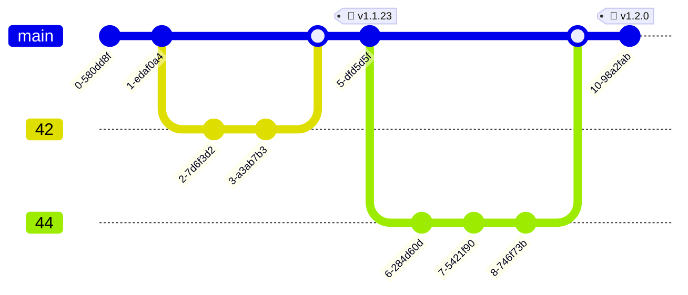

Это краткое руководство для начинающих, о том, как работать
с открытым исходным кодом в рамках практик GitHub flow. Все
примеры будут с платформой GitHub, но можно использовать и другие
хостинги репозиториев, которые предоставляют необходимый
функционал для реализации GitHub flow. Здесь вы можете найти
классический способ внести свой вклад почти в любой проект. А так
же узнать несколько советов и хаков.

Итак, с чего же начинается любой вклад. В идеале, с проблемы.
Проблемой можно называть что угодно, в том числе нехватка
каких-то новых фич, отсутствие либо неполнота страниц
документации по определённому вопросу, какой-то вопрос, либо же
банальные баги, которые есть везде. Лично вы проблему ни с чем не
спутаете, ведь она обязательно будет сопровождать зудящим
чувством, что "что-то подбешивает." Но будет ли это проблемой для
других пользователей и разработчиков? Для того, чтобы это понять
и синхронизировать ваше представление с представлениями команды,
и существует issue.

## Issue

Issue представляет из себя тикет, который хранится в репозитории.
Создать его может любой человек, пришедший в репозиторий. Но
я рекомендую вам, перед тем как бросаться описывать, вашу
проблему, сделать несколько попыток по поиску подобных issue,
чтобы не нагружать лишней работой мейнтейнеров репозитория.
Давайте посмотрим как это можно сделать:

```sh
gh issue list --search "app crashed"
```

> Этот и все дальнейшие примеры будут с использованием
> официальной утилиты `gh`. Она позволяет из консоли выполнять
> все базовые операции с GitHub. Я рекомендую использовать её для
> простых операций, для ускорения работы.

Параметр `search` позволяет задавать прям в себе добавлять
различные фильтры поиска. Давайте попробуем их добавить:

```sh
gh issue list --search "app crashed is:open label:bug created:>2024-01-01"
```

Вполне возможно, особенно в крупных проектах, что это позволит
вам выйти на уже заведённый тикет по вашей проблеме и даже найти
в нём решение или ответ. Если же нет, то не стесняйтесь
открывать новый issue. Наилучшим образом его структурировать
поможет схема:


В крупных проектах существуют issue templates, которые помогут
вам оформить issue в соответствии с теми стандартными, которые
приняты в этом проекте. Создать issue можно командой:

```sh
gh issue create
```

Так же отличной практикой является предоставление docker образа,
в котором настроено все окружение, и проблема гарантированно
воспроизводима. Либо хотя бы предоставить лог. Профессиональным
подходом так же будет локализация проблемы, настолько насколько
это возможно. Например, вы получили ошибку в таком файле:

```python
import fruits
import logistic

a = fruits.Apple()
basket = fruits.MakeBasket()
basket.put(a)
logistic.send(basket)
```

Конечно, можно было бы так в issue и написать. Но еще лучше будет
самостоятельно поэкспериментировать с этим кодом и понять, что
именно не так. Например проверить удалось ли добавить яблоко
в корзину:

```python
basket.put(a)
print(basket.content())
```

Возможно проблема в том, что мы пытаемся отправить пустую
корзину, что будет означать баг в методе `put`. Либо же все-таки
проблема в методе `send`. Таким образом, мы срезаем лишнее,
оставляя в сообщении issue суть проблемы.

Помните, о том, что даже факт заведения успешного issue,
например, предложения ценной фичи или обнаружение реального бага
или уязвимости — это уже вклад в проект, и это уже успех.
А неуспехом будет создание дублирующего issue или перегрузка
мейнтейнеров лишним контекстом.

## Fork

Когда вы поняли какую проблемы вы решаете и убедились, что это
реально проблема, можно переходить к её решению. Для этого стоит
для начала сделать fork репозитория. Это будет, как ценным
подспорьем для вас если вы, например, будете тестировать CI или
просто сильно опережать оригинальный репозиторий, так и позволит
отправлять pull request-ы, ведь вы, скорее всего, не имеете прав
для внесения изменений в оригинальный репозиторий:

```sh
gh repo fork <OWNER>/<REPO>
```

Клонировав fork локально вносите изменения в отдельной ветке,
которую будет удобнее назвать номером issue, который вы пытаетесь
закрыть. Почему? Потому что в коротком лаконичном названии ветки
**далеко** не всегда удастся выразить суть проблемы, на которую,
возможно, ушло несколько месяцев обсуждения в тиките. Поэтому
гораздо удобнее просто на него сослаться, через номер issue:

```sh
git switch -c 42
```

В GitHub flow мы не создаем сложную структуру из веток, где
у каждой есть свое значение. Вместо этого у нас есть master-ветка
в которую попадают только прошедшие все проверки изменения.
А попадают они туда из множества, так называемых feature-веток,
которые мы предлагаем тут привязывать к конкретным issue. А раз
в какое-то время мы на master ветке выпускаем релиз. В итоге
получается вполне лакончиная структура:



Так же не забывайте синхранизировать ваш `fork`, чтобы не
потерять связь с оригинальным проектом:

```sh
gh repo sync <your-username>/<fork-repo> --branch main
```

## Pull request

Когда изменения внесены и закоммичены, то можно отправлять pull
request. Удобнее всего просто остаться на вашей ветке и выполнить
команду ниже. `gh` сам сформирует подходящий pull request:

```sh
gh pr create
```

После создания PR могут автоматически запуститься проверки, если
в репозитории настроен CI. И это отлично. Потому что проверки
упрощают и ускоряют процесс ревью. Вы сразу можете увидеть, что
в вашем коде например не проходят проверки стилей, или, что вы не
написали тесты на свой код и из-за этого упал code coverage. Не
игнорируйте это, а делайте новой коммиты в той же ветки и после
пуша они автоматически добавятся в PR и проверки будут
перезапущены. Мейнтейнер репозитория даже не начнет ревью вашего
PR, пока все проверки в нем не станут зелёными. Проверить статус
pull request-а вы можете командой:

```sh
gh pr status
```

Так же старайтесь сделать аккуратную историю коммитов в pull
request-е, чтобы упросить процесс review. В этом вам помогут
[squash](https://www.geeksforgeeks.org/git/git-squash/) коммиты.

Когда вы прорвались через все авто-проверки, не стесняйтесь
обращаться к архитектору репозитория и просить его ревью. Он либо
сам сделает ревью вашего PR, либо делегирует это кому-то из
команды. На GitHub это делается просто через тег: `@username`.
Часто уведомления о том, что пришёл новый pull request могут быть
отключены, и тем более архитектор не узнает, когда вы внесете все
правки, чтобы пройти CI. Поэтому скромность здесь может привести
к тому, что ваш pull request просто никто не увидит. Тоже,
кстати, касается и issue.

Если вы понимаете, что ваш pull request полностью закрывает тот
issue, который вы решали, то в сообщениях PR можно указать `Close
\#49`, тогда issue будет автоматически закрыт после слияния pull
request-а.

## Merge

Итак, когда вы прошли все авто-проверки и ручное ревью, то ваш
код попадет в master-ветку репозитория и вы можете считать себя
полноправным контрибьютором в этот проект. Так держать!

Обратите так же внимание на интересную практику, которая, на мой
взгляд, очень профессиональна. Представим что вы обнаружили
и доложили о каком-то баге в issue. Это уже вклад в репозиторий.
Дальше предлагается создать pull request, в котором вы пишете
тест, который воспроизводит этот баг. Тест конечно-же будет
падать. Но вы присылать pull request, внося тем самым этот тест
в состоянии disabled в кодовую базу. Так же можно оставить `TODO`
метку. И это станет еще большим вкладом в репозиторий, поскольку
вы добавили содержательный тест, а этом всегда очень полезно.
И наконец вторым pull request-ом вы уже присылаете изменения,
которые чинят код так, чтобы он проходил этот тест. И вновь
увеличиваете ваш вклад. Таким образом вы оставили после себя
массу артефактов в репозитории: issue, усиленная система тестов,
и исправленный баг. Это будет отличным примером реализации TDD
(Test Driven Development) подхода.

Вы можете проверить свои силы уже сейчас, найдя подходящий issue
с помощью этих прекрасных сервисов:

- [Good First Issue](https://goodfirstissue.dev/) — Issue,
  которые отлично подходят для новичков.
- [Awesome for
  Beginners](https://github.com/MunGell/awesome-for-beginners)
  — Подборка проектов для начинающих.
- [Up For Grabs](https://up-for-grabs.net/#/) — Открытые для
  решения задачи по разным технологиям.
- [First
  Contributions](https://github.com/firstcontributions/first-contributions)
  — Репозиторий с манулом с списком открытых проектов.
- [First Timers Only](https://www.firsttimersonly.com/) — Больше
  подобных ресурсов.

Не забывайте, что вы и сами можете регистрировать свои проекты на
этих ресурсах, чтобы привлекать к себе новых разработчиков!

> [!NOTE] GitHub CLI
> Если вас заинтересовала продуктивная работа с GitHub из консоли
> с помощью утилиты `gh`, обратите внимание на её
> [документацию](https://cli.github.com/manual/). А так же на то,
> что `gh` поддерживает расширения, ознакомиться с которыми вы
> можете с помощью команды `gh ext browse` или написать совё!
