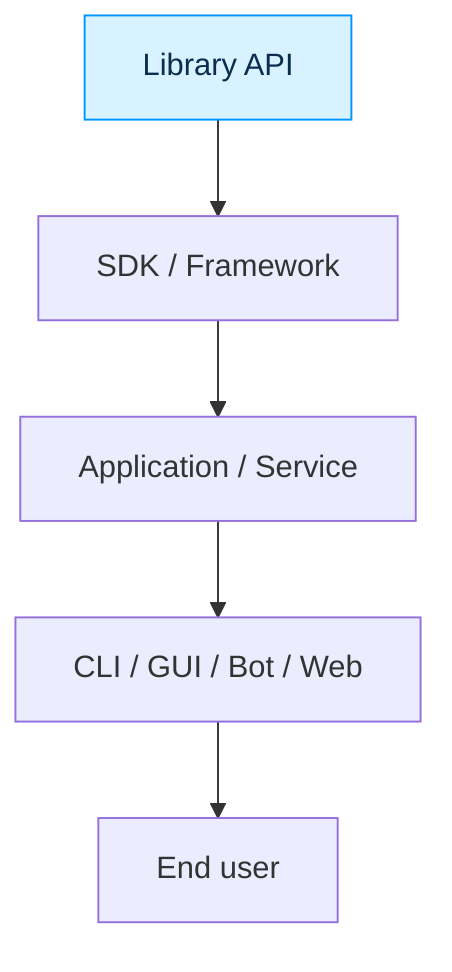
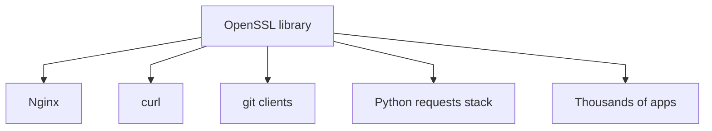
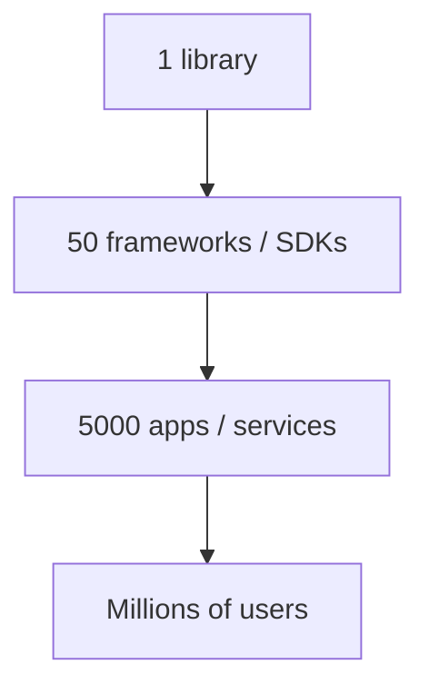

# Start coding typed Python

<p>
  Anton Grishin (<a href="https://t.me/alchemmist"><span class="mono-text">@alchemmist</span></a>)
</p>

<span class="mono-text">EOSP #L2, winter 2026. CU x CPM</span>

<div class="abs-br m-6 text-xl">
  <a href="https://github.com/alchemmist/eosp" target="_blank" class="slidev-icon-btn">
    <carbon:logo-github />
  </a>
</div>

---
layout: center
---

# Table of contents

|                                              |                                                              |
| -------------------------------------------- | ------------------------------------------------------------ |
| <code style="color:#0096FF">lib</code>       | Why library is the core of the whole system.                |
| <code style="color:#50C878">typing</code>    | Typing in Python: from basics to practical static analysis. |
| <code style="color:#FFBF00">code</code>      | Review of the `lib-demo` repository structure.              |
| <code style="color:#D22B2B">live-demo</code> | Add one metric end-to-end and run `mypy`.                   |
| <code style="color:#5D3FD3">uv</code>        | Dependency and tooling workflow with `uv`.                  |

<Footer slot="footer" />

---
layout: center
---

# Why library is core of the whole system<MarkerX color="#0096FF" title="lib" />

Library is the lowest reusable interface:
it exposes capabilities that many higher-level tools build on top of.

<Footer slot="footer" />

---
layout: two-cols-header
---

# Interface levels<MarkerX color="#0096FF" title="lib" />

From low-level primitives to user-facing products.

::left::

<div v-click="1" style="width: 180px;">



</div>

::right::

<ul>
  <li v-click="2">Library defines stable primitives and contracts</li>
  <li v-click="3">Upper layers can change without rewriting the core</li>
  <li v-click="4">The lower the layer, the wider the potential reuse</li>
  <li v-click="5">Backward compatibility pressure is highest at this layer</li>
</ul>

<Footer slot="footer" />

---
layout: two-cols-header
---

# Famous libraries everywhere<MarkerX color="#0096FF" title="lib" />

Most users consume apps, not libraries directly.

::left::

| Library | Where it appears |
| ------- | ---------------- |
| `libc` | almost every Unix program |
| `OpenSSL` | HTTPS, certificates, secure APIs |
| `zlib` | zip/png/http compression |
| `SQLite` | browsers, messengers, mobile apps |

::right::

<ul>
  <li v-click>Users often do not know these names</li>
  <li v-click>Most teams consume them indirectly via frameworks</li>
  <li v-click>But millions of products depend on them daily</li>
  <li v-click>A good library gets huge reach through integrations</li>
  <li v-click>This is the strongest leverage point for engineering impact</li>
</ul>

<Footer slot="footer" />

---
layout: two-cols-header
---

# Case study: C standard library (`libc`)<MarkerX color="#0096FF" title="lib" />

Most C/C++ programs touch `libc` from first lines of code.

::left::

```c
#include <stdio.h>
#include <stdlib.h>
#include <string.h>

int main(void) {
    char *buf = malloc(128);
    strcpy(buf, "hello");
    printf("%s\n", buf);
    free(buf);
    return 0;
}
```

::right::

<ul>
  <li v-click><code>printf</code>, <code>malloc</code>, <code>free</code>, <code>memcpy</code> are core primitives</li>
  <li v-click>Shell tools, databases, servers, compilers all rely on them</li>
  <li v-click>App UX may change, but low-level contracts stay stable for years</li>
  <li v-click>If these contracts break, the blast radius is ecosystem-wide</li>
</ul>

<Footer slot="footer" />

---
layout: center
---

# Case study: OpenSSL<MarkerX color="#0096FF" title="lib" />

Library first, products second.


<div v-click="1" style="width: 550px;">



</div>

<ul>
  <li v-click>End users think they use a browser, messenger, bank app</li>
  <li v-click>Under the hood they use TLS primitives from a library</li>
  <li v-click>One library improvement propagates to a huge ecosystem</li>
  <li v-click>One vulnerability also propagates fast, so quality bar is high</li>
</ul>

<Footer slot="footer" />

---
layout: two-cols-header
---

# Case study: `zlib` and `SQLite`<MarkerX color="#0096FF" title="lib" />

Invisible components with huge practical surface area.

::left::

`zlib` in real traffic:

```python
import zlib

payload = b"hello" * 1000
compressed = zlib.compress(payload, level=6)
raw = zlib.decompress(compressed)
assert raw == payload
```

Used in:
<ul>
  <li v-click>HTTP <code>gzip</code>/<code>deflate</code></li>
  <li v-click>ZIP and many package formats</li>
  <li v-click>PNG internal chunks</li>
</ul>

::right::

`SQLite` in local products:

```python
import sqlite3

conn = sqlite3.connect("app.db")
conn.execute("create table if not exists events(ts int, name text)")
conn.execute("insert into events values (?, ?)", (1739320000, "start"))
conn.commit()
```

Used in:
<ul>
  <li v-click>Browsers, mobile apps, messengers, IDEs often embed this model</li>
  <li v-click>Users almost never notice it, but they rely on it every day</li>
  <li v-click>This is exactly why library layer gives maximal audience reach</li>
  <li v-click>Distribution comes through adoption chains, not direct marketing</li>
</ul>

<Footer slot="footer" />

---
layout: two-cols-header
---

# Why library gives widest reach<MarkerX color="#0096FF" title="lib" />

The adoption funnel expands through integrations.

::left::

<div v-click="1" style="width: 200px;">



</div>

::right::

<ul>
  <li v-click>Low-level API is reused by many teams and products</li>
  <li v-click>Consumers may not know your name, but still use your code daily</li>
  <li v-click>This is strategic leverage: one core, many channels</li>
  <li v-click>Library quality decisions compound across every dependent product</li>
</ul>

<Footer slot="footer" />

---
layout: center
---

# What makes a library truly reusable<MarkerX color="#0096FF" title="lib" />

Reach appears only if the interface is engineered well.


<ul>
  <li v-click>Stable API contracts (minimal breaking changes)</li>
  <li v-click>Clear boundaries and composable primitives</li>
  <li v-click>Predictable error model and explicit return values</li>
  <li v-click>Strong typing and tests at public boundaries</li>
  <li v-click>Good docs and examples for quick integration</li>
  <li v-click>Versioning discipline and changelog quality</li>
  <li v-click>Backwards compatibility as default mindset</li>
  <li v-click>Performance and security as part of API design</li>
</ul>

<Footer slot="footer" />

---
layout: center
---

# Library mindset<MarkerX color="#0096FF" title="lib" />

Build primitives, not just features.

<ul>
  <li v-click>App feature solves one product scenario</li>
  <li v-click>Library primitive can solve many scenarios in many products</li>
  <li v-click>That is why the library layer is the most scalable engineering asset</li>
  <li v-click>Your best bet for long-term impact is a clean, dependable public API</li>
</ul>

<Footer slot="footer" />

---
layout: center
---

# Typed Python<MarkerX color="#50C878" title="typing" />

Today we treat typing as an engineering tool, not syntax decoration.

<ul>
  <li v-click>How to model real contracts at API and domain boundaries</li>
  <li v-click>How to keep code readable while making static checks strict</li>
  <li v-click>How to avoid common anti-patterns that make typing noisy</li>
  <li v-click>Practical recommendations you can apply right after the lecture</li>
</ul>

<Footer slot="footer" />

---
layout: two-cols-header
---

# Dynamic vs static typing<MarkerX color="#50C878" title="typing" />

Same business logic, different failure moment.

::left::

<div v-click>

C (error before run):

```c
int discount(int total_cents, int percent) {
    return total_cents - total_cents * percent / 100;
}
// discount("1000", 15); // compile-time type error
```

</div>

<div v-click>

Python without checks (error during execution path):

```python
def discount(total_cents, percent):
    return total_cents - total_cents * percent / 100

# comes from request payload
total = "1000"
price = discount(total, 15)  # runtime failure
```

</div>

::right::

<ul>
  <li v-click="3">Static typing shifts many failures to development stage</li>
  <li v-click="4">In Python, annotations + analyzers emulate this safety net</li>
  <li v-click="5">Recommendation: enforce typing first on public library API</li>
  <li v-click="6">Practice note: late type errors in boundary code are expensive to debug</li>
</ul>

<Footer slot="footer" />

---
layout: center
---

# Typing in Python is for code quality<MarkerX color="#50C878" title="typing" />

<ul>
  <li v-click>Not for Python runtime speed by itself</li>
  <li v-click>For early bug detection before production</li>
  <li v-click>For clearer interfaces and cleaner architecture</li>
  <li v-click>For better IDE hints and safer refactoring</li>
  <li v-click>For reducing trivial test cases about primitive mismatches</li>
  <li v-click>Recommendation: combine strict typing with focused business tests</li>
</ul>

<Footer slot="footer" />

---
layout: two-cols-header
---

# Interface, abstract class, protocol<MarkerX color="#50C878" title="typing" />

Three related tools, different coupling.

::left::

<ul>
  <li v-click><b>Interface</b>: only abstract methods</li>
  <li v-click><b>Abstract class</b>: abstract + implemented methods</li>
  <li v-click><b>Protocol</b>: structural typing (implicit interface)</li>
  <li v-click>Recommendation: prefer protocol for pluggable adapters</li>
</ul>

::right::

<div v-click="4">

```python
from typing import Protocol
from collections.abc import Iterable

class UserRepo(Protocol):
    def save(self, login: str) -> None: ...
    def all(self) -> Iterable[str]: ...

class SqliteRepo:
    def save(self, login: str) -> None:
        ...
    def all(self) -> list[str]:
        return ["alice", "bob"]

def export(repo: UserRepo) -> list[str]:
    return [u.upper() for u in repo.all()]
```

`SqliteRepo` matches protocol without inheritance.

</div>

<Footer slot="footer" />

---
layout: two-cols-header
---

# Primitive annotations<MarkerX color="#50C878" title="typing" />

Start from boundary functions where wrong types enter the system.

::left::

```python
from decimal import Decimal

def compute_fee(amount: Decimal, fee_rate: float) -> Decimal:
    if fee_rate < 0:
        raise ValueError("fee_rate must be non-negative")
    return amount * Decimal(str(fee_rate))
```

::right::

<ul>
  <li v-click>Input types after <code>:</code></li>
  <li v-click>Return type after <code>-></code></li>
  <li v-click>Common primitives: <code>str</code>, <code>int</code>, <code>float</code>, <code>bool</code>, <code>bytes</code></li>
  <li v-click>Recommendation: for money, prefer <code>Decimal</code> over <code>float</code></li>
  <li v-click>Recommendation: annotate return type even when it seems obvious</li>
</ul>

<Footer slot="footer" />

---
layout: two-cols-header
---

# Union types<MarkerX color="#50C878" title="typing" />

Use unions when multiple input types are truly valid.

::left::

```python
import json

def parse_payload(raw: str | bytes) -> dict[str, object]:
    if isinstance(raw, bytes):
        raw = raw.decode("utf-8")
    return json.loads(raw)
```

```python
def parse_positive_int(value: str) -> int | None:
    if not value.isdigit() or int(value) <= 0:
        return None
    return int(value)
```

::right::

<ul>
  <li v-click>Good: <code>int | None</code> for optional result</li>
  <li v-click>Risky: broad return unions like <code>int | str | dict</code></li>
  <li v-click>If union grows too much, redesign API</li>
  <li v-click>Recommendation: keep union small and semantically clear</li>
</ul>

<Footer slot="footer" />

---
layout: two-cols-header
---

# Typing collections<MarkerX color="#50C878" title="typing" />

Specify container element types.

::left::

```python
def top_repo(repos: list[tuple[str, int]]) -> tuple[str, int] | None:
    if not repos:
        return None
    return max(repos, key=lambda r: r[1])

def avg_review_time(hours: list[float]) -> float:
    return sum(hours) / len(hours) if hours else 0.0

def total_prs(by_user: dict[str, int]) -> int:
    return sum(by_user.values())
```

::right::

<ul>
  <li v-click>Avoid generic <code>list</code> / <code>dict</code> without params</li>
  <li v-click>Type details improve both safety and readability</li>
  <li v-click>Recommendation: express semantic meaning in nested collection types</li>
  <li v-click>Practice note: most bugs in metrics code happen in data shape assumptions</li>
</ul>

<Footer slot="footer" />

---
layout: two-cols-header
---

# `Mapping` vs `MutableMapping`<MarkerX color="#50C878" title="typing" />

Signal read-only vs mutable behavior.

::left::

```python
from collections.abc import Mapping, MutableMapping

def read_config(cfg: Mapping[str, str]) -> str:
    return cfg["DATABASE_URL"]

def patch_config(cfg: MutableMapping[str, str]) -> None:
    cfg["DEBUG"] = "true"
    cfg.setdefault("LOG_LEVEL", "info")
```

::right::

<ul>
  <li v-click>If function only reads: prefer <code>Mapping</code></li>
  <li v-click>If function mutates: require <code>MutableMapping</code></li>
  <li v-click>Recommendation: narrower input contract makes side effects explicit</li>
  <li v-click>Practice note: this small choice improves code review quality a lot</li>
</ul>

<Footer slot="footer" />

---
layout: two-cols-header
---

# `NamedTuple`<MarkerX color="#50C878" title="typing" />

Immutable tuple with named fields.

::left::

```python
from typing import NamedTuple

class User(NamedTuple):
    id: int
    username: str
    merged_prs: int
```

::right::

```python
def print_user(user: User) -> str:
    return f"{user.username} ({user.id}) -> {user.merged_prs} merged PRs"
```

<ul>
  <li v-click>Good for compact immutable records</li>
  <li v-click>If mutability is needed, prefer <code>dataclass</code></li>
  <li v-click>Recommendation: use for small query result rows and snapshots</li>
</ul>

<Footer slot="footer" />

---
layout: two-cols-header
---

# `TypedDict`<MarkerX color="#50C878" title="typing" />

Typed shape for dictionary-like JSON data.

::left::

```python
from typing import NotRequired, TypedDict

class RepoPayload(TypedDict):
    id: int
    name: str
    private: bool
    language: NotRequired[str | None]
```

::right::

```python
def from_payload(data: RepoPayload) -> str:
    lang = data.get("language") or "unknown"
    return f"{data['name']} ({lang})"
```

<ul>
  <li v-click>Great for external payload validation at static level</li>
  <li v-click>Can declare optional keys explicitly</li>
  <li v-click>Recommendation: use `TypedDict` at transport layer, convert to domain model next</li>
  <li v-click>Practice note: keeps API chaos away from business logic</li>
</ul>

<Footer slot="footer" />

---
layout: two-cols-header
---

# `dataclass`<MarkerX color="#50C878" title="typing" />

Readable domain objects with defaults and generated methods.

::left::

```python
from dataclasses import dataclass

@dataclass
class User:
    id: int
    username: str
    email: str | None = None
    score: int = 0

    def activate_bonus(self, bonus: int) -> None:
        if bonus < 0:
            raise ValueError("bonus must be >= 0")
        self.score += bonus
```

::right::

<ul>
  <li v-click>Mutable by default, so protect invariants in methods</li>
  <li v-click>Use <code>@dataclass(frozen=True)</code> for immutable entities</li>
  <li v-click>Recommendation: prefer dataclass for DTO/domain state containers</li>
  <li v-click>Practice note: once behavior grows heavy, switch to regular class</li>
</ul>

<Footer slot="footer" />

---
layout: two-cols-header
---

# `Enum`<MarkerX color="#50C878" title="typing" />

Closed set of allowed domain values.

::left::

```python
from enum import Enum

class Status(Enum):
    NEW = "new"
    IN_REVIEW = "in_review"
    DONE = "done"
    FAILED = "failed"
```

::right::

```python
def can_merge(status: Status) -> bool:
    return status in {Status.IN_REVIEW, Status.DONE}
```

<ul>
  <li v-click>Avoids random string values across codebase</li>
  <li v-click>Recommendation: map external strings to enum right after parsing</li>
  <li v-click>Practice note: enum is cheap and prevents many typo-level bugs</li>
</ul>

<Footer slot="footer" />

---
layout: two-cols-header
---

# Custom classes in annotations<MarkerX color="#50C878" title="typing" />

Your own classes are first-class types too.

::left::

```python
class User:
    id: int
    username: str
    email: str
    friends: list["User"]

class Team:
    members: list[User]
```

::right::

```python
def add_friend(team: Team, user: User, friend: User) -> None:
    if user not in team.members or friend not in team.members:
        raise ValueError("both users must be in team")
    user.friends.append(friend)
```

<ul>
  <li v-click>Domain classes in signatures make intent obvious</li>
  <li v-click>Recommendation: avoid <code>dict[str, Any]</code> in core logic signatures</li>
  <li v-click>When signatures use real entities, architecture boundaries become clearer</li>
  <li v-click>Practice note: this reduces accidental cross-layer coupling over time</li>
</ul>

<Footer slot="footer" />

---
layout: two-cols-header
---

# Abstract collection classes<MarkerX color="#50C878" title="typing" />

Use behavior-based input contracts.

::left::

```python
from collections.abc import Iterable

def total_commits(per_week: Iterable[int]) -> int:
    return sum(per_week)

def top3(values: Iterable[int]) -> list[int]:
    return sorted(values, reverse=True)[:3]
```

::right::

<ul>
  <li v-click><code>Iterable</code>, <code>Sequence</code>, <code>Mapping</code> and others come from <code>collections.abc</code></li>
  <li v-click>Prefer importing these ABCs from <code>collections.abc</code> directly</li>
  <li v-click>Recommendation: annotate by behavior required by the algorithm</li>
  <li v-click>Practice note: this reduces accidental over-coupling to <code>list</code></li>
</ul>

<Footer slot="footer" />

---
layout: two-cols-header
---

# `Sequence` vs `Iterable`<MarkerX color="#50C878" title="typing" />

The difference is operation guarantees.

::left::

```python
from collections.abc import Iterable, Sequence

def avg_any(values: Iterable[int]) -> float:
    total, count = 0, 0
    for v in values:
        total += v
        count += 1
    return total / count if count else 0.0
```

::right::

```python
def median3(values: Sequence[int]) -> int:
    return sorted(values)[len(values) // 2]
```

<ul>
  <li v-click><code>Iterable</code>: can loop</li>
  <li v-click><code>Sequence</code>: can loop + index + len</li>
  <li v-click>Recommendation: do not require <code>Sequence</code> if one pass is enough</li>
  <li v-click>Practice note: this keeps APIs compatible with generators/streams</li>
</ul>

<Footer slot="footer" />

---
layout: two-cols-header
---

# `Callable`<MarkerX color="#50C878" title="typing" />

Type callbacks and higher-order functions.

::left::

```python
from collections.abc import Callable

def retry(
    action: Callable[[], str],
    on_error: Callable[[Exception], None],
    attempts: int = 3,
) -> str:
    for _ in range(attempts):
        try:
            return action()
        except Exception as e:
            on_error(e)
    raise RuntimeError("all retries failed")
```

::right::

<ul>
  <li v-click>Prefer explicit argument and return signatures</li>
  <li v-click><code>Callable[..., T]</code> is possible but weaker</li>
  <li v-click>Recommendation: type callback signatures early in async/event code</li>
  <li v-click>Practice note: production bugs often hide in callback contracts</li>
</ul>

<Footer slot="footer" />

---
layout: two-cols-header
---

# Generics with `TypeVar`<MarkerX color="#50C878" title="typing" />

Preserve relation between input and output types.

::left::

```python
from collections.abc import Mapping
from typing import TypeVar

T = TypeVar("T")

def pick_or_fail(items: Mapping[str, T], key: str) -> T:
    if key not in items:
        raise KeyError(key)
    return items[key]
```

::right::

<ul>
  <li v-click>If mapping value is `Repo`, return type is inferred as `Repo`</li>
  <li v-click>Without generics this collapses to `Any` and safety is lost</li>
  <li v-click>Recommendation: use generics for reusable repository/service helpers</li>
</ul>

<Footer slot="footer" />

---
layout: two-cols-header
---

# Bounded generics<MarkerX color="#50C878" title="typing" />

Restrict allowed types with `bound=`.

::left::

```python
from collections.abc import Iterable
from datetime import datetime
from typing import TypeVar

TimestampT = TypeVar("TimestampT", bound=datetime)

def latest(items: Iterable[TimestampT]) -> TimestampT:
    return max(items)
```

::right::

<ul>
  <li v-click>Useful when algorithm needs specific capabilities</li>
  <li v-click>Bound keeps generic reusable but not unconstrained</li>
  <li v-click>Recommendation: start concrete, generalize with `bound` later</li>
  <li v-click>Bounded generics are a good compromise between flexibility and safety</li>
</ul>

<Footer slot="footer" />

---
layout: two-cols-header
---

# `Literal`<MarkerX color="#50C878" title="typing" />

Constrain exact accepted values.

::left::

```python
from typing import Literal

def export_report(
    format: Literal["csv", "json"],
    mode: Literal["full", "compact"] = "compact",
) -> bytes:
    ...
```

::right::

<ul>
  <li v-click>Typos like <code>"jsno"</code> are caught statically</li>
  <li v-click>Excellent for modes, statuses, fixed strategy names</li>
  <li v-click>Recommendation: use `Literal` when values are tiny and closed</li>
  <li v-click>If variants start growing, move from `Literal` to `Enum`</li>
</ul>

<Footer slot="footer" />

---
layout: center
---

# Static analyzers<MarkerX color="#50C878" title="typing" />

| Tool      | Main strength                   | Typical tradeoff                    |
| --------- | ------------------------------- | ----------------------------------- |
| `mypy`    | mature ecosystem and plugins    | needs strictness tuning             |
| `pyright` | fast, strong diagnostics        | less plugin flexibility             |
| `pyrefly` | very fast Rust implementation   | younger tool, behavior still moving |
| `ty`      | modern Rust architecture (beta) | pre-release maturity                |

<ul>
  <li v-click>Recommendation: pick one tool as CI gate, keep others optional</li>
  <li v-click>Practice note: mixed analyzer requirements usually confuse teams</li>
  <li v-click>In team projects, consistency of diagnostics is more important than tool preference</li>
</ul>

<Footer slot="footer" />

---
layout: two-cols-header
---

# Install and run analyzers with `uv`<MarkerX color="#50C878" title="typing" />

::left::

```sh
uv tool install mypy
uv tool install pyright
uv tool install pyrefly
uv tool install ty
```

::right::

```sh
uvx mypy .
uvx pyright .
uvx pyrefly check
uvx ty check
```

<ul>
  <li v-click>Recommendation: in CI prefer <code>uv run mypy src tests</code></li>
  <li v-click>Use <code>uvx</code> for local experiments and tool comparison</li>
  <li v-click>Pin one analyzer version in CI to avoid random baseline drift</li>
  <li v-click>Keep local command aliases in `Makefile`/scripts for team consistency</li>
</ul>

<Footer slot="footer" />

---
layout: two-cols-header
---

# Analyzer demo: intentional typing bugs<MarkerX color="#50C878" title="typing" />

::left::

````md magic-move {lines: true}
```python {*|11|15|20-22|*}
from dataclasses import dataclass
from typing import NewType

UserId = NewType("UserId", int)

@dataclass
class User:
    id: UserId
    email: str
    is_active: bool

def discount(total: int, percent: int) -> int:
    return total - total * (percent / 100)

def send_invoice(user: User, amount: int) -> str:
    if not user.is_active:
        return None
    return f"invoice for {user.email}: {amount}"

def main() -> None:
    user = User(id=42, email=123, is_active="yes")
    total = discount("1000", 10)
    send_invoice(user, "500")
```
````

::right::

<div v-click>

`pyright` catches multiple issues before runtime:

- `float` returned where `int` expected
- `None` returned where `str` expected
- invalid `User` field types
- invalid function call argument types
- domain identifier misuse (`NewType` violation)

Recommendation:
- fix type contracts first, then clean call sites
- do not silence these errors with broad ignores

</div>

<Footer slot="footer" />

---
layout: two-cols-header
---

# Stub files (`.pyi`)<MarkerX color="#50C878" title="typing" />

Type code you cannot or do not want to edit.

::left::

`calc.py`

```python
def fetch_user(user_id):
    # legacy code we do not want to refactor now
    ...
```

::right::

`calc.pyi`

```python
def fetch_user(user_id: int) -> dict[str, str]: ...
```

<ul>
  <li v-click>Recommendation: use stubs for generated/legacy/third-party code</li>
  <li v-click>Keeps typing strict without touching risky implementation paths</li>
</ul>

<Footer slot="footer" />

---
layout: two-cols-header
---

# `TypeAlias`<MarkerX color="#50C878" title="typing" />

Improve readability for complex or business-specific types.

::left::

```python
from typing import TypeAlias

UserId: TypeAlias = int
MetricName: TypeAlias = str
MetricsPayload: TypeAlias = dict[MetricName, int | float]
```

::right::

```python
type UserId = int
type MetricName = str
type MetricsPayload = dict[MetricName, int | float]
```

<ul>
  <li v-click>Right block is Python 3.12+ syntax</li>
  <li v-click>Recommendation: alias business terms to make signatures readable</li>
  <li v-click>Practice note: this pays off immediately in reviews and docs</li>
</ul>

<Footer slot="footer" />

---
layout: two-cols-header
---

# `TypeAlias` vs `NewType`<MarkerX color="#50C878" title="typing" />

Same runtime family, different static guarantees.

::left::

```python
from typing import NewType, TypeAlias

UserId: TypeAlias = int
RepoId = NewType("RepoId", int)
```

::right::

```python
def get_user(user_id: UserId) -> None:
    ...

def get_repo(repo_id: RepoId) -> None:
    ...
```

<ul>
  <li v-click><code>TypeAlias</code> is only a synonym</li>
  <li v-click><code>NewType</code> protects domain IDs from accidental mix</li>
  <li v-click>Recommendation: use <code>NewType</code> for IDs crossing module boundaries</li>
  <li v-click>Practice note: prevents subtle bugs in service glue code</li>
</ul>

<Footer slot="footer" />

---
layout: center
---

# How to use typing correctly<MarkerX color="#50C878" title="typing" />

<ul>
  <li v-click>Types must fail on wrong code, otherwise they do not protect you</li>
  <li v-click>Start small, increase strictness gradually</li>
  <li v-click>Strict typing and strict tests work as two safety nets</li>
  <li v-click>Recommendation: enforce strictness per module, not all at once</li>
  <li v-click>Recommendation: avoid `Any` in new business logic without clear reason</li>
</ul>

<Footer slot="footer" />

---
layout: two-cols-header
---

# Returning `None` explicitly<MarkerX color="#50C878" title="typing" />

Always annotate return type, even if it is obvious from implementation.

::left::

```python
def log_metrics(metrics: dict[str, int]) -> None:
    for name, value in metrics.items():
        print(f"{name}: {value}")

tmp = log_metrics({"prs": 12}) + 1
```

::right::

```plaintext
error:
  Operator "+" not supported for types "None" and "Literal[1]"
```

<ul>
  <li v-click>Without return annotation, intent is ambiguous for readers</li>
  <li v-click>Recommendation: explicitly annotate all public function returns</li>
  <li v-click>Practice note: this improves code navigation speed</li>
</ul>

<Footer slot="footer" />

---
layout: center
---

# Function input vs output<MarkerX color="#50C878" title="typing" />

A function should be more explicit about concrete return type than about accepted input type.

<ul>
  <li v-click>Inputs can be abstract (<code>Iterable</code>, <code>Mapping</code>, protocols)</li>
  <li v-click>Outputs should usually be concrete (<code>list</code>, <code>dict</code>,<code>User</code>)</li>
  <li v-click>Recommendation: be liberal in accepted input, strict in returned shape</li>
  <li v-click>Practice note: explicit outputs reduce integration misunderstandings</li>
</ul>

<Footer slot="footer" />
---
layout: center
---

# Repository structure review<MarkerX color="#FFBF00" title="code" />

Now map typing rules to our real project scaffold: `lib-demo`.

<Footer slot="footer" />

---
layout: center
---

# Live demo plan<MarkerX color="#D22B2B" title="live-demo" />

Add one metric end-to-end: API payload -> typed entity -> metric function -> test -> `mypy`.

<Footer slot="footer" />

---
layout: two-cols-header
---

# Live demo: step-by-step<MarkerX color="#D22B2B" title="live-demo" />

::left::

1. Add typed payload model with `TypedDict`
2. Parse GitHub response to domain entities
3. Add metric function (example: `total_open_issues`)
4. Add unit test for metric
5. Configure and run `mypy`

::right::

```sh
uv sync
uv add --dev mypy
uv run mypy src tests
uv run pytest
```

<Footer slot="footer" />

---
layout: two-cols-header
---

# Live demo: metric example<MarkerX color="#D22B2B" title="live-demo" />

::left::

```python
from collections.abc import Iterable
from gh_contrib_demo.core.entities.issue import Issue


def total_open_issues(items: Iterable[Issue]) -> int:
    return sum(1 for _ in items)
```

::right::

```python
from gh_contrib_demo.core.entities.issue import Issue
from gh_contrib_demo.core.metrics import total_open_issues


def test_total_open_issues() -> None:
    issues = [Issue(id=1, number=10), Issue(id=2, number=11)]
    assert total_open_issues(issues) == 2
```

<Footer slot="footer" />

---
layout: two-cols-header
---

# Live demo: strict `mypy` baseline<MarkerX color="#D22B2B" title="live-demo" />

::left::

`pyproject.toml`

```toml
[tool.mypy]
python_version = "3.12"
strict = true
warn_return_any = true
warn_unused_ignores = true
```

::right::

<ul>
  <li v-click>Start strict early in the library layer</li>
  <li v-click>Fix root causes, avoid blanket <code># type: ignore</code></li>
</ul>

<Footer slot="footer" />

---
layout: center
---

# Why `uv` is a savior<MarkerX color="#5D3FD3" title="uv" />

`uv` is not just another installer. It is a consolidation point for Python workflows.

<ul>
  <li v-click>Official docs position it as package + project manager written in Rust</li>
  <li v-click>Goal: one fast tool instead of fragmented chains of utilities</li>
  <li v-click>Important in education: less setup overhead, more engineering time</li>
</ul>

<Footer slot="footer" />

---
layout: two-cols-header
---

# The dependency pain in Python<MarkerX color="#5D3FD3" title="uv" />

::left::

Historical pipeline (simplified):

```plaintext
manual installs / setup.py
  -> easy_install (setuptools era)
  -> pip + virtualenv
  -> pip-tools / pipx / twine
  -> conda, pyenv, poetry, rye, ...
```

::right::

<ul>
  <li v-click>`easy_install` was a big step, but is now deprecated</li>
  <li v-click>`pip` improved packaging workflows and requirements files</li>
  <li v-click>Then ecosystem split into many specialized tools</li>
  <li v-click>Result: powerful stack, but high cognitive load for beginners</li>
  <li v-click>Team problem: everyone has different local setup ritual</li>
</ul>

<Footer slot="footer" />

---
layout: two-cols-header
---

# Why `uv` in practice<MarkerX color="#5D3FD3" title="uv" />

::left::

From official docs, key capabilities:

- 10-100x faster than `pip` in many workflows
- single tool replacing `pip`, `pip-tools`, `pipx`,
  `poetry`, `pyenv`, `twine`, `virtualenv`, and more
- universal lockfile and project dependency management
- script support with inline metadata
- install/manage Python versions (`uv python ...`)
- pip-compatible interface (`uv pip ...`)

Why this matters in our course:

- one command vocabulary for all students
- reproducible environments in every homework/repo
- fewer "works on my machine" failures

::right::

```sh
# Python versions
uv python install 3.12
uv python pin 3.12

# project lifecycle
uv sync
uv add requests
uv add --dev mypy pytest ruff
uv lock
uv run pytest

# scripts and one-off tools
uv run script.py
uvx ruff check .

# migration path for pip users
uv pip compile requirements.in -o requirements.txt
uv pip sync requirements.txt
```

<Footer slot="footer" />

---
layout: center
---

# Summary<MarkerX color="#5D3FD3" title="uv" />

`uv` practical cheat sheet:

```sh
# Day 1 in a new repo
uv python install 3.12
uv python pin 3.12
uv sync
uv run pytest

# Add deps during feature work
uv add httpx
uv add --dev mypy ruff
uv lock

# One-off tools and scripts
uvx pyright .
uv run scripts/check_metrics.py
```

<ul>
  <li v-click>Recommendation: standardize these commands in docs/Makefile</li>
  <li v-click>Outcome: predictable onboarding and reproducible CI behavior</li>
</ul>

<Footer slot="footer" />

---
layout: center
---

# Homework

<ul>
  <li v-click>Read <code>longreads/typing-python.en.md</code> fully</li>
  <li v-click>Install <code>uv</code> and run checks in <code>lib-demo</code></li>
  <li v-click>Add one typed metric with tests in your own branch</li>
  <li v-click>Run <code>mypy</code> and fix all reported errors</li>
</ul>

<Footer slot="footer" />

---
layout: end
---
