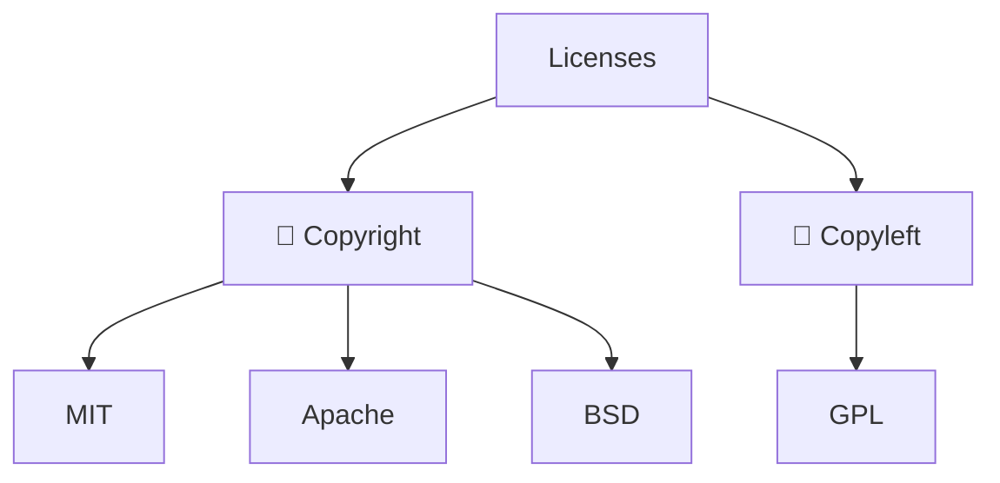
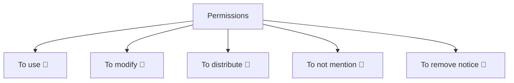

# Attractive repository

  Anton Grishin (<a href="https://t.me/alchemmist">@alchemmist</a>)

EOSP #L6, winter 2026. CU x CPM

  <a href="https://github.com/alchemmist/eosp" target="_blank" class="slidev-icon-btn">
    <carbon:logo-github />
  </a>

---
layout: center
---

# Table of contents

|                                            |                                                                 |
| ------------------------------------------ | --------------------------------------------------------------- |
| <code style="color:#50C878">intro</code>   | A combination of factors.                                       |
| <code style="color:#0096FF">license</code> | How to choose a license.                                        |
| <code style="color:#FFBF00">readme</code>  | Recomendations for good readme.                                 |
| <code style="color:#D22B2B">CI</code>      | Automate all checks without installatino and configuring tools. |
| <code style="color:#5D3FD3">make</code>    | Entry point into repository. Useful tool.                       |

---
layout: center
---

# Attractive = combination of factors<MarkerX color="#50C878" title="intro" />

<ul>
    <li v-click>Can I trust you? How do you position your code?<code>LICENSE.txt</code> exaplain that!</li>
    <li v-click>What is it? How to use it? <code>README.md</code> or website exaplain that!</li>
    <li v-click>How to configure it? How to up it locally? GitHub wiki or website exaplgin that!</li>
    <li v-click>Can I ask some questions? GitHub discuessions exaplain that!</li>
    <li v-click>How to report bugs? Issue templates exaplain that!</li>
    <li v-click>How to contribute? <code>CONTRIBUTING.md</code> explain that!</li>
    <li v-click>What are the rules in the codebase? CI exaplain that!</li>
    <li v-click>Can I rely on this project? Speed of releasing exaplain that!</li>
    <li v-click>And something else: time to merge, PL, stars, many countributors, many issues, ...</li>
</ul>

---
layout: two-cols
footer: false
gap: 0
---

# Success is predictable<MarkerX color="#50C878" title="intro"/>

«<a href="https://dl.acm.org/doi/epdf/10.1145/2972958.2972966">Predicting the Popularity of GitHub Repositorie</a>», 9th Sepetember 2016, Hudson Borges, Andre Hora, Marco Tulio ValenteASERG Group. doi: 10.1145/2972958.2972966.

<ul>
    <li v-click="2">In study was developed some predication model.</li>
    <li v-click="3">This model was try on a few of pupular repositoryes for precation their growth in the next mounths.</li>
    <li v-click="4">And model working not bad!</li>
    <li v-click="5">For us it's mean, that if we will follow some rules, the probability of success will increase.</li>
</ul>

::right::

<Image v-click="1" src="/assets/stars-predict.png" width="500px"/>

---
layout: center
---

# Your guarantee to users<MarkerX color="#0096FF" title="license"/>

License tells your users and contributors how they are allowed to use your code.

---
layout: center
---

# The structure of license world<MarkerX color="#0096FF" title="license"/>

<v-clicks depth="2">

- Two categories of licenses: <b>copyright</b> and <b>copyleft</b>.
  - Copyright (permissive): allows almost any use of the code with minimal restrictions.
  - Copyleft: requires that derivative works keep the same license.
- Major licenses: <b>MIT</b>, <b>Apache</b>, <b>BSD</b>, <b>GPL</b>.
  - MIT: use, modify, distribute, sell; keep copyright and license text.
  - Apache 2.0: permissive + patent grant; patent rights terminate if you sue.
  - BSD: similar to MIT; no endorsement using the author's name.
  - GPL: strong copyleft; distributed modifications must also be GPL.
  - Overall it's a mess 🥴.
- And many many more! You can even write your own license.
- For example: you could allow only students from France to use your code and prohibit everyone else.

</v-clicks>

---
layout: center
---

# Type of license premissions<MarkerX color="#0096FF" title="license"/>

---
layout: two-cols
footer: false
---

# Recomendation: MIT<MarkerX color="#0096FF" title="license"/>

<v-clicks depth="1">

- Very simple and permissive — almost anyone can use your code.
- Minimal legal overhead — just keep the copyright notice.
- Compatible with almost any other license.
- Encourages adoption — companies and developers feel safe using it.
- Flexible — allows closed-source derivatives if needed.
- Widely recognized and trusted in the Open Source community.

</v-clicks>

::right::

<Image src="/assets/mit.png" width="700px"/>

---
layout: center
---

# The face of repo<MarkerX color="#FFBF00" title="readme" />

Let's see some examples. And define a few recommendations.

---
layout: full
footer: false
---

# Is it good<MarkerX color="#FFBF00" title="readme" />?

<Image src="/assets/bad-readme.png" width="1150px"/>

---
layout: full
footer: false
---

# And this one?

<Image src="/assets/good-readme.png" width="1200px"/>

---
layout: center
---

# Recommendations<MarkerX color="#FFBF00" title="readme" />

<v-clicks depth="2">

- ...

</v-clicks>
